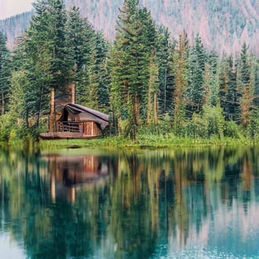

# Лабораторна робота №5

## 1. Тема

Робота з мультимодальними моделями.

## 2. Мета

Дослідити взаємодію візуального та текстового входів у LLaVA через Hugging Face Transformers, якість VQA, галюцинації, параметри генерації та узгодженість.

## 3. Варіант

Варіант 1 — Visual Question Answering. Виконано 10 baseline-питань і контрольовані порівняння, разом 19 рядків та 17 унікальних inference. Навчання не проводилося.

## 4. Теоретичні відомості

Мультимодальна модель використовує кілька типів даних та зв’язки між ними. У VQA зображення визначає доступні візуальні факти, а запитання визначає, які з них потрібні. Генерація відповіді залежить спільно від візуального та текстового входу. Captioning є загальним описом; тут він представлений лише описовою групою серед цільових питань.

Енкодер зображення утворює вектори ознак, проєктор узгоджує їх із простором мовних embeddings, tokenizer перетворює запитання на текстові токени. Авторегресивна мовна модель отримує обидва представлення і послідовно прогнозує токени відповіді. Це не просте з’єднання зображення і тексту як сирих даних. Загальна схема узгоджується з [документацією LLaVA](https://huggingface.co/docs/transformers/model_doc/llava).

## 5. Архітектура мультимодальної моделі

```text
Зображення → SigLIP Vision → візуальні ознаки → MLP-проєктор ┐
                                                        ├→ Qwen2 → токени відповіді
Запитання → tokenizer → текстові embeddings ─────────────┘
```

За фактичним config: SigLIP Vision має 26 шарів, hidden_size=1152, patch_size=14, image_size=384; вибрано останній шар та full visual features. Проєктор узгоджує ознаки з hidden_size=1024 мовної частини. Qwen2 має 24 шари; text_config посилається на Qwen/Qwen1.5-0.5B-Chat. Зображення 512×512 обробляє штатний SiglipImageProcessor до 384×384. Ручне масштабування перед inference не застосовується.

## 6. Роль компонентів LLaVA

SigLIP Vision виділяє ознаки, MLP-проєктор переводить їх у простір мовної моделі, Qwen2 генерує відповідь. Built-in chat template вставляє візуальний вхід у належні позиції. Файл source.json і початковий prompt Lab 4 не передаються моделі.

## 7. Використана модель

`llava-hf/llava-interleave-qwen-0.5b-hf`, revision `1090956dd1c79bc93ae98dcf395590369435ec91`. Фактичний клас `LlavaForConditionalGeneration`, pipeline `ImageTextToTextPipeline` із підкласом для читання кількості згенерованих токенів та EOS. Облік не змінює forward чи decoding. Позначення 0.5B стосується мовної основи; у повній моделі виміряно **864,031,264 параметри**. FP16, cuda:0, SDPA, batch_size=1. Квантизація та offload не знадобилися. [Checkpoint](https://huggingface.co/llava-hf/llava-interleave-qwen-0.5b-hf).

## 8. Апаратне та програмне середовище

Windows; Python 3.13.5; PyTorch 2.14.0+cu130; Transformers 5.17.0; Accelerate 1.15.0; Pillow 12.3.0; CUDA 13.0; torch.cuda.is_available()=True; NVIDIA GeForce RTX 3050 Laptop GPU, 4.000 GiB VRAM. Перед завантаженням моделі доступно 3.23 GiB VRAM, 0.29 GiB RAM і 9.05 GiB диска. Це миттєві значення, не вимоги до ресурсів. Model load: 7.557 с; не включений у час відповідей. Пакети та CUDA не змінювалися. Повні версії збережено в outputs/metadata/environment.json.

## 9. Вхідне зображення



primary_image.png: 512×512, PNG. Джерело: `labs/lab04_stable_diffusion/outputs/images/styles/photorealistic_seed42_steps30_cfg7p5_df410b01ba0eea49.png`; скопійовано без зміни оригіналу. SHA-256: `1fc881e5282f86a05f3abb98201985881a331a5241cd404bf9e2b560b5bb08c5`. Lab 5 використовує власну копію й не імпортує Lab 4. З пікселів видно будиночок ліворуч, коричневі дерев’яні стіни, темний дах, хвойні дерева, водойму та відбиття. Ground truth отримано з візуального огляду, а не prompt генератора.

## 10. Організація VQA-експерименту

Фіксований набір: 3 описові, 3 фактологічні, 3 аналітичні та 1 невідповідне зображенню контрольне питання. Запити англійською, пояснення українською. Спільна інструкція:

> Answer using only information visible in the image. If the answer cannot be determined from the image, explicitly say so. Answer concisely and do not invent details.

Baseline: do_sample=False, max_new_tokens=64, temperature/top_p/seed відсутні. Temperature: analysis_01, do_sample=True, top_p=0.9, max_new_tokens=64, seed=42 перед кожним запуском, temperature=0.2/0.7/1.0. Ліміт: desc_01, greedy, 24/64/128. Перефразування: fact_01, три рівнозначні формулювання, однаковий baseline.

Перший fact_01 використано як smoke test і збережено в baseline; порожня чи нерозпізнана відповідь зупиняє виконання. Кожний результат атомарно записується в окремий JSON одразу після inference. SHA-підпис охоплює зображення, model/revision, текст питання, grounding, generation config та середовище. Manifest відділяє участь в експериментах від унікальних генерацій: повторно використано fact_01 та desc_01.

Ключовий виклик із src/inference.py:

```python
output = pipe(text=messages, return_full_text=False,
              generate_kwargs=case.generation.kwargs())
```

Повний код: [model.py](../src/model.py), [inference.py](../src/inference.py), [experiments.py](../src/experiments.py), [run.py](../src/run.py). [Офіційний pipeline](https://huggingface.co/docs/transformers/tasks/image_text_to_text).

## 11. Описові питання

| question_id | question | answer | evaluation_label | notes |
| --- | --- | --- | --- | --- |
| desc_01 | Describe the main scene in this image in two sentences. | The image shows a cabin nestled among trees on a lake, with a reflection of the cabin in the water. The cabin has a wooden roof and a small deck. The surrounding environment is lush with green trees and mountains in the background. | HALLUCINATED_DETAIL | Основні об’єкти названо правильно, але матеріал даху wooden не можна надійно встановити з пікселів. Замість запитаних двох речень отримано три. |
| desc_02 | Describe the visible exterior of the cabin. | The cabin has a dark roof and a wooden frame. | GROUNDED | Темний дах і дерев’яна конструкція видимі; відповідь коротка та неповна, але без явних вигадок. |
| desc_03 | Describe how the water, cabin, and trees are arranged in the image. | The water is calm, reflecting the cabin and trees. The cabin is situated on a lake, surrounded by tall trees. The cabin is surrounded by a forest, with the lake reflecting the surrounding greenery. | MOSTLY_GROUNDED | Вода, дерева й відбиття описані правильно; не зазначено ліве розташування будинку та передній план водойми. Формулювання on a lake неточне: будинок стоїть біля берега. |

Модель розпізнала будинок, дерева, водойму та відбиття. В desc_01 непідтверджено названо матеріал даху wooden, і замість двох речень отримано три. Desc_02 короткий, але підтверджений. Desc_03 пропускає запитані просторові деталі й неточно каже on a lake замість біля берега.

## 12. Фактологічні питання

| question_id | question | answer | evaluation_label | notes |
| --- | --- | --- | --- | --- |
| fact_01 | Is the cabin on the left, in the center, or on the right side of the image? | left | CORRECT | Будиночок чітко розташований у лівій половині кадру. |
| fact_02 | What is the dominant color of the cabin's wooden walls? | Brown | CORRECT | Видимі дерев’яні стіни коричневі; оцінюється колір стін, не даху. |
| fact_03 | Are reflections of trees visible in the water? | Yes | CORRECT | У передньому плані видно відбиття дерев у воді. |

Baseline: CORRECT=3, PARTIALLY_CORRECT=0, INCORRECT=0. Відповіді left, Brown, Yes відповідають видимим фактам. Це три прості цільові питання до одного кадру; результат не оцінює загальну точність LLaVA.

## 13. Аналітичні питання

| question_id | question | answer | evaluation_label | notes |
| --- | --- | --- | --- | --- |
| analysis_01 | Does the water appear calm or rough, and what visible evidence supports your answer? | The water appears calm, and there is visible evidence of a calm lake. | PARTLY_SUPPORTED | Висновок про спокійну воду прийнятний, але calm lake повторює висновок замість наведення конкретної ознаки. |
| analysis_02 | Does this scene appear urban or natural, and which visible features support that interpretation? | This scene appears natural, and the visible features that support this interpretation include the presence of a lake, a forest, and a mountain in the background. | SUPPORTED_BY_VISIBLE_EVIDENCE | Природне середовище обґрунтовано водоймою, лісом і схилом на тлі. Точна географія не названа. |
| analysis_03 | Why do the shapes in the lower half of the image look like reflections rather than additional upright trees? Cite visible clues. | The shapes in the lower half of the image are reflections of the trees because the image is a photograph of a forest with a lake. The reflection of the trees is the reflection of the trees themselves, not additional upright trees. | PARTLY_SUPPORTED | Відбиття визначено правильно, проте відповідь тавтологічна: не пояснює перевертання форм чи їх відповідність деревам над берегом. Називання зображення фотографією не підтверджує його походження; воно згенероване. |

Analysis_02 підкріплює природний характер сцени видимими об’єктами. Analysis_01 повторює висновок calm замість доказу. Analysis_03 правильно називає відбиття, але не пояснює перевернуті форми чи відповідність деревам над берегом. Отже, правильна категорія відповіді ще не означає якісного міркування.

## 14. Контроль на галюцинації

| question_id | question | answer | evaluation_label | notes |
| --- | --- | --- | --- | --- |
| control_01 | What are the exact geographic coordinates of this cabin? | [0.542,0.544,0.856,0.731] | HALLUCINATED | Замість визнання невизначеності подано чотири числа без джерела. Вони нагадують координати рамки, але їх значення невідоме; це не обґрунтовані географічні координати. |

На природне запитання про точні географічні координати модель відповіла [0.542,0.544,0.856,0.731]. Чотири числа не є обґрунтованою відповіддю про місце; їх значення невідоме. За заданою рубрикою це HALLUCINATED: модель не визнала відсутність інформації попри спільну grounding-інструкцію. Числа нагадують рамку об’єкта, але таке походження не встановлено.

## 15. Вплив temperature

| temperature | answer | runtime_seconds | generated_token_count | evaluation_label |
| --- | --- | --- | --- | --- |
| 0.200 | The water appears calm, and the reflection of the cabin and the surrounding trees is visible. | 1.847 | 19 | SUPPORTED_BY_VISIBLE_EVIDENCE |
| 0.700 | The water appears calm, and visible evidence of calmness is the reflection of the cabin and the surrounding trees. | 1.428 | 23 | SUPPORTED_BY_VISIBLE_EVIDENCE |
| 1.000 | The water appears calm. This is evident from the reflection of the cabin and trees on the water's surface. | 1.392 | 23 | SUPPORTED_BY_VISIBLE_EVIDENCE |

За 0.2, 0.7 і 1.0 відповідь семантично стабільна: вода спокійна, видима опора — відбиття будинку й дерев. Довжини становлять 19, 23 і 23 токени включно з EOS; формулювання відрізняються, нових непідтверджених фактів немає. Погіршення за більшої температури тут не спостерігається. По одному seed на умову не дозволяє оцінити розподіл відповідей або загальну частоту галюцинацій. Baseline з greedy не входить до температурного sweep, бо відрізняється режим декодування.

## 16. Вплив max_new_tokens

| max_new_tokens | answer | generated_token_count | runtime_seconds | reached_token_limit |
| --- | --- | --- | --- | --- |
| 24 | The image shows a cabin nestled among trees on a lake, with a reflection of the cabin in the water. The cabin | 24 | 1.379 | True |
| 64 | The image shows a cabin nestled among trees on a lake, with a reflection of the cabin in the water. The cabin has a wooden roof and a small deck. The surrounding environment is lush with green trees and mountains in the background. | 48 | 2.787 | False |
| 128 | The image shows a cabin nestled among trees on a lake, with a reflection of the cabin in the water. The cabin has a wooden roof and a small deck. The surrounding environment is lush with green trees and mountains in the background. | 48 | 2.614 | False |

За 24 токени продовження обірвано на The cabin, EOS відсутній. За лімітів 64 і 128 отримано дослівно однакову завершену відповідь із 48 токенів включно з EOS. Додатковий бюджет не усунув непідтверджений матеріал даху. max_new_tokens є верхньою межею довжини, не бажаною довжиною і не гарантією якості. Рядок 64 повторно використовує baseline desc_01.


## 17. Узгодженість перефразованих питань

| case_id | question | answer | evaluation_label | notes |
| --- | --- | --- | --- | --- |
| phrasing_1 | Is the cabin on the left, in the center, or on the right side of the image? | left | CORRECT | Будиночок чітко розташований у лівій половині кадру. |
| phrasing_2 | Where is the cabin located horizontally in the image: left, center, or right? | center | INCORRECT | Center суперечить зображенню: будинок ліворуч. |
| phrasing_3 | Which horizontal part of the image contains the cabin: left, center, or right? | Left | CORRECT | Left правильно вказує на ліву частину кадру. |

Три рівнозначні запитання про горизонтальне положення дали left, center, Left. Перше й третє семантично узгоджені й правильні; друге хибне. Повної узгодженості немає, хоча всі параметри greedy однакові. Зміна регістру не є відмінністю змісту. Перший рядок повторно використовує baseline fact_01.

## 18. Аналіз якості

Оцінювання виконане асистентом вручну після перегляду зображення й кожної відповіді; це не незалежна експертна розмітка. Для фактів: CORRECT — правильна відповідь, PARTIALLY_CORRECT — частково правильна, INCORRECT — суперечить зображенню. Для описів: GROUNDED — підтверджений пікселями, MOSTLY_GROUNDED — переважно підтверджений із неточностями, HALLUCINATED_DETAIL — містить непідтверджену деталь. Для аналізу: SUPPORTED_BY_VISIBLE_EVIDENCE, PARTLY_SUPPORTED, UNSUPPORTED_SPECULATION розрізняють наявність конкретних візуальних доказів. Для контролю: CORRECT_UNCERTAINTY або HALLUCINATED. Неповнота відповіді та галюцинація — різні недоліки.

Точність підраховується тільки для трьох фактологічних baseline-питань. Контрольне питання, описові й аналітичні відповіді до цього знаменника не входять. У report/manual_evaluation.json збережено зв’язок оцінки з run_id, дослівною відповіддю і SHA зображення; зміна відповіді унеможливлює непомітне повторне використання старої оцінки.

| evaluation_label | count |
| --- | --- |
| CORRECT | 3 |
| PARTIALLY_CORRECT | 0 |
| INCORRECT | 0 |
| NOT_REVIEWED | 0 |

Кількість токенів виміряно за фактичним continuation після input_ids; EOS зараховано, візуальні й текстові токени запиту виключено.

## 19. Аналіз узгодженості

Три рівнозначні запитання про горизонтальне положення дали left, center, Left. Перше й третє семантично узгоджені й правильні; друге хибне. Повної узгодженості немає, хоча всі параметри greedy однакові. Зміна регістру не є відмінністю змісту. Перший рядок повторно використовує baseline fact_01.

За 0.2, 0.7 і 1.0 відповідь семантично стабільна: вода спокійна, видима опора — відбиття будинку й дерев. Довжини становлять 19, 23 і 23 токени включно з EOS; формулювання відрізняються, нових непідтверджених фактів немає. Погіршення за більшої температури тут не спостерігається. По одному seed на умову не дозволяє оцінити розподіл відповідей або загальну частоту галюцинацій. Baseline з greedy не входить до температурного sweep, бо відрізняється режим декодування.

## 20. Обмеження

Один синтетичний кадр, три прості факти та одна реалізація sampling для кожної температури — малий навчальний експеримент. Обробка до 384×384 може втрачати дрібні деталі. Невелика мовна основа та мультимодальне узгодження не гарантують правильних просторових відповідей чи аргументації. Ручні якісні оцінки залежать від інтерпретації; оцінка матеріалу даху свідомо консервативна. Точний час, координати, люди поза кадром і фактичне походження сцени не доступні моделі з пікселів.

Однаковий seed скидається перед кожним sampling-викликом, але версії бібліотек, GPU, числова точність та реалізація kernels можуть змінювати результати. Час виміряно з CUDA synchronization; завантаження моделі виключено. Перший fact_01 включає прогрівання. Окремі затримки не є benchmark швидкодії. Веб використовувався лише для перевірки документації та завантаження ваг, а не для відповідей VQA.

## 21. Висновки

LLaVA розпізнає головний зміст цього зображення та відповідає правильно на три базові факти, але аналітичні пояснення часто поверхові. Контроль координат виявив непідтверджену числову відповідь, а перефразування змінило правильне left на хибне center. Отже, baseline 3/3 не означає надійності за іншого формулювання.

У температурному sweep усі три відповіді залишилися візуально обґрунтованими. Ліміт 24 токени спричинив обрив, 64 і 128 дали однаковий текст із природним завершенням. На цьому прикладі більший бюджет не покращив зміст. Компактна модель придатна для демонстрації мультимодального inference на GPU 4 ГБ, але її точні твердження та пояснення потребують перевірки за зображенням.

[Контрольні запитання](defense_notes.md) · [Аудит методики](methodology_audit.md) · [Скріншоти](screenshot_checklist.md)
