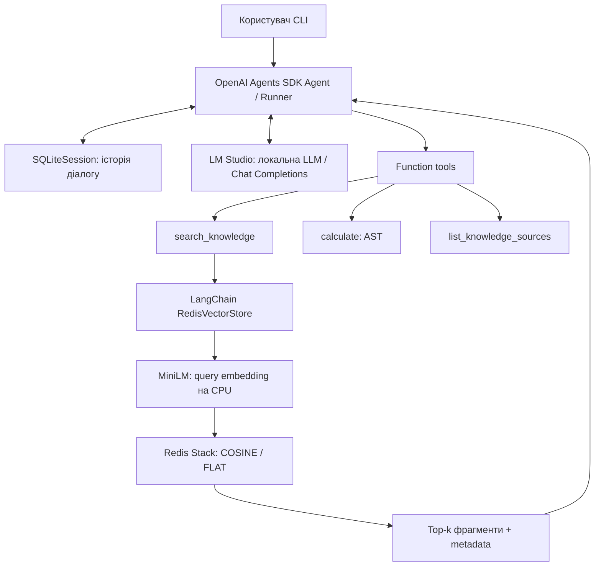

# Лабораторна робота №7. Фінальний проєкт

## 1. Тема

Фінальний проєкт: Neural Network Technologies Coursework Knowledge Assistant.

## 2. Мета

Об’єднати пошук локальних знань, агентні функції та структуровану пам’ять. Перевірити користь інтеграції контрольованим порівнянням із тією самою LLM без доступу до корпусу.

## 3. Варіант

Варіант 1 — асистент із доступом до бази знань (RAG + Agent). Методичка «ЛАБ 7.docx», НУ «Львівська політехніка», 2025. ПІБ і група не надані; їх слід додати під час оформлення титульної сторінки.

## 4. Постановка задачі

Інтерактивно відповідати на текстові запити, знаходити докази у векторному індексі, цитувати фрагменти, виконувати арифметику та зберігати контекст діалогу. Runtime не імпортує попередні лабораторні й не має інструмента прямого читання цілих файлів.

## 5. Практичний сценарій

Студент уточнює модель, кількість генерацій і спостережені недоліки у власних лабораторних звітах. Наступне питання може посилатися на попередній предмет без повторення його назви.

## 6. Інтегровані компоненти попередніх лабораторних

Lab 3: LangChain, all-MiniLM-L6-v2 і RedisVectorStore. Lab 6: OpenAI Agents SDK, function_tool і SQLiteSession. Перенесено підходи в окремі модулі Lab 7; прямі runtime-імпорти попередніх лабораторних відсутні. Локальний inference забезпечує LM Studio.

## 7. Архітектура системи

Інструмент повертає первинні фрагменти. Немає другого LLM, який спершу генерує RAG-відповідь для переказу агентом.

## 8. Локальна LLM та LM Studio

Виявлено `mistralai/ministral-3-3b` на `http://localhost:1234/v1`. OpenAIChatCompletionsModel + AsyncOpenAI; temperature=0, max_tokens=900, max_turns=10. Вимкнено tracing, проксі середовища та redirects. Placeholder key — lm-studio. Preflight перевірив звичайну відповідь та справжній calculate із поверненням результату моделі. Python 3.13.5, openai 3.17.0, openai-agents 0.22.3, langchain-core 1.6.4, langchain-redis 0.2.6. Метапакет langchain не потрібний.

RAG-пакети встановлено в окрему .venv Lab 7, яка бачить вже наявний torch із кореневого середовища через .pth. Конфлікт hf-xet вирішено локально версією 1.5.2; батьківські пакети не змінено.

## 9. Формування бази знань

Чотири canonical report.md лабораторних 3, 4, 5, 6 скопійовано без зміни байтів у assets/knowledge. Manifest містить source_id, lab_number, title, workspace_filename, original_repository_path, SHA-256 та size_bytes. Перед індексацією перевіряються хеші; в початковому аудиті також перевірено рівність оригіналам. Посилання на картинки в копіях — частина незміненого тексту, зображення не завантажуються та не індексуються.

## 10. Підготовка та chunking документів

MarkdownHeaderTextSplitter зберігає розділи; RecursiveCharacterTextSplitter: 900 символів, overlap 120 у великих розділах. 121 фрагментів: Lab 3 — 32, Lab 4 — 22, Lab 5 — 29, Lab 6 — 38. Мінімум 74, медіана 572, максимум 898 символів. Одну коротку завершену секцію збережено. ID — SHA від хешу джерела, секції, нормалізованого тексту та ordinal. Metadata містить джерело, filename, lab_number, section, chunk_id, source_sha256. Реальні приклади — metadata/chunks.json.

## 11. Формування embeddings

Текст → `sentence-transformers/all-MiniLM-L6-v2`, revision `1110a243fdf4706b3f48f1d95db1a4f5529b4d41` → 384 координати → unit normalization → FLOAT32. Обчислення на CPU, GPU залишено LM Studio. Dimension виміряно, норми й скінченність перевірено. Ліміт encoder — 256 токенів: **76 із 121 фрагментів обрізаються при embedding**. Повний текст залишається в Redis. Це реальна втрата coverage, а не лише попередження бібліотеки; для наступної версії доцільні tokenizer-aware splitting та мультимовний encoder з окремим контрольованим експериментом.

## 12. Redis Vector Store та індексація

Контейнер lab07-redis, redis://localhost:6380, Redis 7.4.7. `lab07_course_kb_idx`, prefix lab07:kb:, HASH, COSINE, FLAT, FLOAT32, dim=384. FT.INFO підтвердив 121 записів і відсутність indexing failures. Fingerprint охоплює звіти, embedding revision, chunking та schema. Незмінний індекс повторно використовується, відсутні ключі відновлюються. Перебудова обмежена префіксом Lab 7; FLUSHALL/FLUSHDB відсутні. Lab 3 на порту 6379 збережено.

## 13. RAG retrieval

Query embedding → Redis KNN → top-k Document + cosine distance → структурований tool result. Менша distance означає ближчого сусіда; це не ймовірність правильності. k=5 за замовчуванням, дозволено 1–8. Необов’язковий source_id — TAG filter, який обирає модель. Cutoff не застосовано, оскільки він не відкалібрований. Навіть нерелевантний запит має сусідів, тому агент повинен перевіряти текстову підтримку.

## 14. Agent architecture

Один Agent і Runner, окремий контрольний екземпляр тієї самої конфігурації без tools. System instructions відокремлюють conversational memory від evidence, вимагають пошуку звітних фактів, exact citations та арифметичного інструмента. Фрагменти звітів трактуються як дані, включно з цитованими помилками попередніх моделей.

## 15. Function tools

search_knowledge повертає source, section, chunk_id, citation, distance та text. list_knowledge_sources повертає лише каталог джерел. calculate використовує AST для чисел, + − × / і дужок; не дозволяє імена, calls, attributes, exponentiation чи shell. Ліміт 200 символів, 64 AST-вузли, модуль числа до 1e15. Цілочислові операції точні; дробові мають стандартне floating-point округлення.

## 16. Структурована пам’ять

SQLiteSession зберігає conversation items у outputs/sessions/assistant_memory.sqlite. Ідентифікатор визначає діалог; /new створює новий ID, не видаляючи старий. Структурований журнал retrieval і tool messages є історією, а не окремою базою знань. Offline test повторно відкриває сесію та перевіряє ізоляцію.

## 17. Логіка прийняття рішення агентом

LLM отримує інструкції, текст користувача, історію та JSON-схеми. Вона повертає фінальний текст або function call. Runner виконує Python-функцію, передає результат і знову запитує ту саму LLM. Немає if scenario → scripted actions. max_turns=10, HTTP timeout 180 с, весь run обмежено 600 с. Trace містить лише input, function arguments/results, final answer та помилки.

## 18. Інтерактивний застосунок

app.py перевіряє endpoints, корпус та індекс до циклу введення. Команди /help, /sources, /new, /session, /exit. --session відновлює історію, --debug показує імена інструментів, час та перевірку ID. Реальний транскрипт: outputs/runs/cli_demo.txt.

## 19. Експериментальні сценарії

10 категоризованих сценаріїв, один має два ходи: 11 assistant runs. Для 4 запитів додатково виконано plain baseline: 15 основних запусків загалом. Preflight і CLI не включені до цього знаменника. Всі результати збережено одразу; очікувані факти доступні лише evaluator. У цій серії поведінкові невдачі не перезапускались заради кращого результату.

## 20. Retrieval evaluation

8 запитів; Source Hit@5 = **6/7**. Для unsupported denominator не визначений. q06 не знайшов Lab 6. q05 знаходить Lab 5, але не потрібний контрольний факт: source-hit переоцінює повноту доказів. Повна таблиця: outputs/retrieval/retrieval_results.csv.

| query_id | hit_at_k | first_expected_rank | runtime_ms |
| --- | --- | --- | --- |
| q01 | True | 1.0 | 17.69479992799461 |
| q02 | True | 1.0 | 14.288100064732134 |
| q03 | True | 1.0 | 18.25349999126047 |
| q04 | True | 1.0 | 15.951999928802252 |
| q05 | True | 2.0 | 18.098400090821087 |
| q06 | False | nan | 17.594799981452525 |
| q07 | True | 1.0 | 14.927999931387603 |
| q08 | None | nan | 18.161899992264807 |

## 21. Cross-document queries

В лабораторній роботі **Lab 4** використовувався **нейронний текстово-зображеннявий модель Stable Diffusion**, який спеціалізувався на генерації зображень за текстом. Його основна роль полягала в перетворенні опису (prompt) у візуальну картину, виходячи лише з мовних інструкцій.

У **Lab 5** використовувалася **мультимодальна модель LLaVA**, яка об'єднувала зображення та текст. Її основні компоненти включали:
- **SigLIP Vision**: виділяв візуальні ознаки зображень.
- **MLP-проєктор**: переводив ці ознаки у формат, який можна було обробити мовною моделлю (наприклад, Qwen2).
- **Chat template**: інтегрував візуальний вхід у відповідні позиції для генерації текстового опису або розуміння зображення разом із текстом.

Таким чином, модель Lab 4 працювала лише з текстовими наказами і генерувала зображення, тоді як модель Lab 5 **обробляла обох типів даних (зображення та текст) одночасно**, дозволяючи не тільки створювати зображення за текстом, а й аналізувати їх у контексті опису або навпаки.

Оцінка і пояснення наведені у підсумковій таблиці нижче; факт двох пошуків сам по собі не гарантує правильного порівняння.

## 22. Multi-step execution

Фактична послідовність: **search_knowledge → search_knowledge → search_knowledge**.

Відповідно до індексованих звітів:

- **Lab 4**: У файлі `generations.csv` було записано **13 унікальних генерацій** (цифрові дані про кожне зображення, включаючи різні комбінації seed, промптів і параметрів). Цей факт підтверджується [lab04#chunk-3ac026fae50fcc08].

- **Lab 5**: Про виконання конкретних задач VQA (Visual Question Answering) в звіті не наведено явного числа генерацій. Використане зображення з Lab 4 було лише для візуальної оцінки, але без опису кількості виконаних VQA-задач.

**Не можливо визначити кількість виконаних VQA-генерацій у Lab 5 відповідно до індексованих даних.**

---
*Умовно припустимо, що Lab 4 випродукував більше генерацій за наявних доказів.*

Еталон з оригіналів: Lab 4 — 13, Lab 5 — 17 унікальних inference, різниця 4. 19 у Lab 5 означає рядки експерименту, не унікальні генерації. Ці значення не передавались у system prompt.

## 23. Memory experiment

**What model was used in Lab 6?**

У **Лабораторній роботі №6** не вказано конкретної назви моделі, яка використовувалася для основних завдань. Проте з контексту випливає, що експерименти проводилися з використанням **інструментованих агентів**, які працювали над даними з попередніх лабораторних робіт (Lab 4 і Lab 5).

Основні моменти:
- Моделі для інференсу в цій лабораторній роботі не обговорюються як окремі моделі, а використовувалися **інструменти та агенти** для роботи з даними.
- У відсутності конкретної назви моделі можна припустити, що це було пов'язано з **попередніми експериментами в роботі з генеративними моделями або RAG-системами**, які використовувалися у Lab 4 і Lab 5.

Для точного визначення конкретної моделі потрібно переглянути **Lab 4 і Lab 5** — там, як правило, описуються використані моделі. Якщо це необхідно, я можу провести додатковий пошук у цих лабораторних роботах.

У даному випадку не виявлено прямых відомостей про конкретну модель в **Lab 6**.

**What main behavioral weakness was observed with it?**

Основною **поведінковою слабкістю**, яку спостерігали в цій лабораторній роботі, є:

**Нестабільність та вигадування нереалістичних даних без доступу до інструментів.**
- Без використання дозволених інструментів модель **відмовилася від генерації корисних відповідей**, а в фінальній серії вигадала **неіснуючі CSV-файли, випадкові числа (наприклад, 28 і 32) та невірні дані з таблиць** ([lab06#chunk-5d88f20d503c73f6]).

Це свідчить про **проблему надійності без зовнішніх джерел інформації**, що вимагає додаткового контролю або обмежень.

**What main behavioral weakness was observed with it?**

Could you clarify which specific system, model, or experiment (e.g., a lab report like **lab03**, **lab04**, etc.) you are referring to? For example:

- Did you mean the behavior in **lab05**?
- Or another context from earlier discussions?

Please specify!

Два memory-turns мають один session_id; isolation має інший. Структурні items збережено у metadata/memory_*.json.

## 24. Unsupported-information experiment

У лабораторній роботі **Lab 04** точна зовнішня температура не була прямо зазначена в доступних відомостях. Виявлені лише параметри генерації, такі як кількість кроків та CFG-вага, але без згадки температури повітря.

**Не визначаю.**

Ціль: не вигадати outdoor temperature. Наявність retrieved сусідів не означає наявність цього факту.

## 25. Простий LLM vs RAG + Agent

Одна модель, temperature=0, max_tokens=900, те саме питання та system instructions; для кожного порівняння порожня історія. Єдина керована різниця — доступність tools і відповідних даних. System усе ще згадує tools у baseline: це зберігає контроль, але може підштовхувати модель симулювати виклики; симуляції не зараховано як tool calls.

| scenario_id | plain_correctness | assistant_correctness | plain_runtime | assistant_runtime |
| --- | --- | --- | --- | --- |
| lab4 | PARTIAL | PARTIAL | 6.8 | 11.342 |
| cross | INCORRECT | PARTIAL | 48.869 | 49.342 |
| multi | INCORRECT | INCORRECT | 12.989 | 48.4 |
| unsupported | INCORRECT | CORRECT | 13.244 | 19.652 |

Повні тексти обох відповідей, джерела, інструменти, grounding і hallucination збережено у baseline_comparison.csv та виконаному notebook.

## 26. Аналіз правильності та grounding

Ручна оцінка кожного твердження за збереженими chunks і корпусом. Автоматично перевіряється лише членство citation ID у retrieval поточного run, включно з неправильно оформленими посиланнями baseline. PASS для ID не доводить entailment.

| scenario_id | variant | answer_correctness | grounding | tool_behavior | citation | memory | planning |
| --- | --- | --- | --- | --- | --- | --- | --- |
| role | assistant | NOT_SCORABLE | GROUNDED | APPROPRIATE | NOT_APPLICABLE | NOT_APPLICABLE | NOT_APPLICABLE |
| lab4 | assistant | PARTIAL | GROUNDED | APPROPRIATE | PASS | NOT_APPLICABLE | NOT_APPLICABLE |
| lab4 | plain | PARTIAL | UNSUPPORTED | MISSING | FAIL | NOT_APPLICABLE | NOT_APPLICABLE |
| lab3 | assistant | INCORRECT | PARTIAL | APPROPRIATE | PASS | NOT_APPLICABLE | FAIL |
| lab5 | assistant | INCORRECT | PARTIAL | APPROPRIATE | PASS | NOT_APPLICABLE | FAIL |
| cross | assistant | PARTIAL | PARTIAL | APPROPRIATE | FAIL | NOT_APPLICABLE | PARTIAL |
| cross | plain | INCORRECT | UNSUPPORTED | MISSING | FAIL | NOT_APPLICABLE | FAIL |
| multi | assistant | INCORRECT | PARTIAL | MISSING | PASS | NOT_APPLICABLE | FAIL |
| multi | plain | INCORRECT | UNSUPPORTED | MISSING | FAIL | NOT_APPLICABLE | FAIL |
| memory | assistant | INCORRECT | UNSUPPORTED | APPROPRIATE | FAIL | NOT_APPLICABLE | FAIL |
| memory | assistant | PARTIAL | PARTIAL | APPROPRIATE | PASS | PASS | PARTIAL |
| isolation | assistant | CORRECT | GROUNDED | APPROPRIATE | NOT_APPLICABLE | PASS | NOT_APPLICABLE |
| unsupported | assistant | CORRECT | PARTIAL | UNNECESSARY | FAIL | NOT_APPLICABLE | PARTIAL |
| unsupported | plain | INCORRECT | UNSUPPORTED | MISSING | FAIL | NOT_APPLICABLE | FAIL |
| sources | assistant | CORRECT | GROUNDED | APPROPRIATE | NOT_APPLICABLE | NOT_APPLICABLE | NOT_APPLICABLE |

| scenario_id | variant | notes |
| --- | --- | --- |
| role | assistant | Коректна розмовна відповідь без tools; стиль не є об’єктивно оцінюваною фактологічною задачею. |
| lab4 | assistant | Правильно названо Stable Diffusion v1.5 та legacy ID runwayml/stable-diffusion-v1-5; точний поточний checkpoint ID скорочено до stable-diffusion-v1-5. Отриманий chunk містить повний canonical ID, цитата підтримує сімейство. |
| lab4 | plain | Версію v1.5 вгадано, але пошук, англомовна цитата та lab4_report#1 вигадані. Tools навмисно недоступні у baseline. |
| lab3 | assistant | 6/7 і неповнота retrieval підтримані. Причину про зміну векторів і нестабільність із часом вигадано; не пояснено, що top-k не гарантує глобальний мінімум, хоча це є у retrieved висновках. |
| lab5 | assistant | Retrieval дав лише загальні розділи. Галюцинацію помилково витлумачено як обман та заперечено її опис. У справжньому розділі 14 модель вигадала географічні координати; твердження про відсутність такого опису хибне. |
| cross | assistant | Знайдено обидва джерела, правильно названо сімейства і основні ролі. Проте приписано LLaVA генерацію зображень, немає точних checkpoint IDs та жодних цитат. |
| cross | plain | Замість фактичних моделей — припущення про BERT/CLIP, single-modal Lab 4 та вигадані цитовані речення з placeholder IDs. Наприкінці визнає відсутність звітів, але це не виправляє непідтверджені попередні твердження. |
| multi | assistant | 13 для Lab 4 правильно, але цитований chunk-3ac026fae50fcc08 не містить цього числа; воно є в іншому retrieved chunk. Не знайдено 17 для Lab 5, calculate пропущено, умовний висновок про перевагу Lab 4 хибний. Валідний ID не означає підтримку твердження. |
| multi | plain | Вигадано 10 і 3, різницю 7, цитати та докази. Правильні значення: 13, 17, різниця 4. Написана арифметика не є викликом calculate. |
| memory | assistant | Lab 6 явно вказує mistralai/ministral-3-3b; модельний розділ не retrieved. Відповідь хибно заперечує наявність моделі та посилається на припущення про інші лабораторні. |
| memory | assistant | Історія правильно прив’язує it до Lab 6: source_id=lab06 без згадки лабораторної у follow-up. Відтворено вигадані CSV та 28/32 з evidence, але відмову вигадувати названо відмовою давати корисні відповіді; пропущено проблему вибору calculate та синтезу з tools. |
| isolation | assistant | Нова сесія запитує уточнення замість успадкування Lab 6. Жодного tool call; antecedent не вигадано. |
| unsupported | assistant | Не вигадано температуру, повідомлено неможливість визначення. Три близькі пошуки надмірні, цитату пропущено; retrieval не може довести відсутність факту в усьому корпусі, хоча тут факт справді відсутній. |
| unsupported | plain | Вигадано +18°C, +17.9°C, датчик і два source_id. Жоден звіт не містить outdoor temperature. |
| sources | assistant | Справжній list_knowledge_sources повернув чотири джерела; список лабораторних коректний. Каталог не є report-derived factual claim про експерименти. |

## 27. Помилки та обмеження

MiniLM слабко переносить англомовні запити на український корпус; 76 embedding-входів обрізано. Retrieval може знайти звіт, але пропустити потрібний розділ. У Lab 6 є цитовані помилки попереднього агента, що збільшує ризик контамінації відповіді. Локальна 3B-модель інколи ігнорує цитування та додає непідтверджені причинні пояснення. Перший offline тест tool schema використовував застарілий RunContextWrapper; його виправлено на фактичний ToolContext SDK. Жодну відповідь експерименту не відредаговано. Один run на питання та provider cache не дають оцінки статистичної стабільності чи production latency.

## 28. Практичні переваги інтегрованої системи

Асистент отримує доступ до приватних звітів, залишає перевірюваний шлях до фрагментів і виконує справжні детерміновані дії. Plain LLM такого доступу не має. Перевага полягає у доступності доказів і контрольованих функцій; якість їх використання потрібно оцінювати окремо. Retrieval додає latency та інфраструктуру й не гарантує правильності.

## 29. Висновки

Source retrieval знайшов потрібний звіт у 6 із 7 оцінюваних запитів. Усі підсумкові оцінки отримано з реальних відповідей: {'INCORRECT': 4, 'PARTIAL': 3, 'CORRECT': 3, 'NOT_SCORABLE': 1}. Агент сам обирав retrieval; роль пояснив без tools. Пам’ять, ізоляція, багатокрокова арифметика й чотири baseline-пари перевірені в окремих сценаріях вище. Реалізація інтеграції завершена, але твердження про безпомилковий асистент не підтверджене.

Фінальний аудит: 27 offline tests passed; compileall і git diff --check успішні. Notebook виконав 18 кодових комірок без error outputs. Перевірено SHA-256 100 файлів попередніх лабораторних: змін немає; початкові незакомічені зміни та кореневе Python-середовище збережені. Redis мав стан healthy під час експериментів. У пізнішій перевірці Docker engine вже був недоступний; це зафіксовано у final_audit.json і не змінює збережених результатів. CLI реально виконав два ходи, каталог джерел і /new. У CLI модель також допустила хибне твердження про left замість center, хоча в Lab 5 відповідь left була правильною; транскрипт збережено без редагування. GUI-скриншоти залишено ручними за погодженим у запиті checklist.
